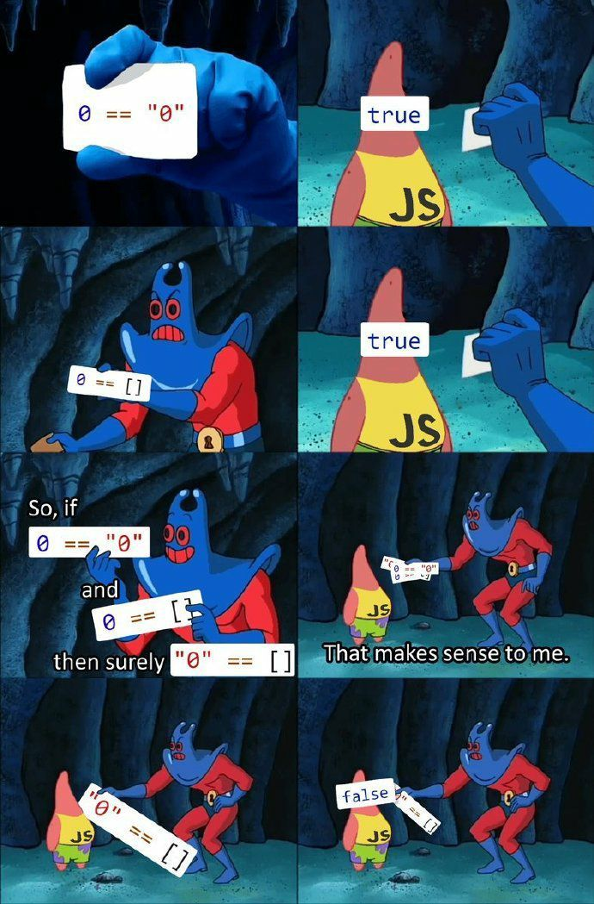
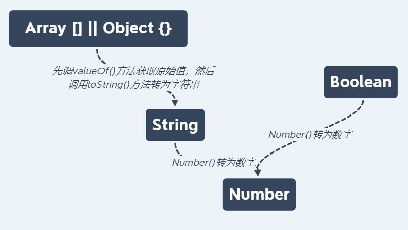

# JS == 与 === 及隐式转化

开头整活

<div align="center">
 
 <p style="color: #e7e7e7">派大星牌编译器</p>
</div>
众所周知，之所以大家现在写 js === 去判断等号两端参数是否相等，是因为 js 的 == 实在过于 emmm...

先来说说 == 与 === 的共同点，都会先判断类型再比较值，如果是基础值（如： number，string）

若是引用值时则会比较其引用

不同的则是 === 是强等，当前后参数类型不同直接返回 false，而 == 在遇到该情况时会对参数进行隐式转化

## 隐式转化

我们先来说说隐式转化

在 js 中，当运算符在运算时，如果两边数据不统一，CPU 就无法计算，这时我们编译器会自动将运算符两边的数据做一个数据类型转换，转成一样的数据类型再计算

这种无需程序员手动转换，而由编译器自动转换的方式就称为隐式转换

例如 1 > "0"这行代码在 js 中并不会报错，编译器在运算符时会先把右边的"0"转成数字 0 然后再比较大小

1. 转成 string、number 类型： +（字符串连接符）（当操作符前后参数类型不一致时）
2. 转成 number 类型：++/--(自增自减运算符) + - \* / %(算术运算符) > < >= <= == != === !=== (关系运算符)
3. 转成 boolean 类型：!（逻辑非运算符）

### 转化规则

<div align="center">
 
 <p style="color: #e7e7e7">隐式转化规则</p>
</div>

当用 == 去比较不同类型的参数时 参数会一直转化类型直到类型相同再比较

好的，看到这里大家会有点懵，那我们就来复盘一下“派大星”处理的那一系列代码

```js
console.log(0 == '0') // true
console.log(0 == []) // true
console.log('0' == []) // false
```

第一个 0 == '0' 很简单，左侧 0 类型为 number ，处于隐式转化类型底层，所以只需把右侧转化为 number 比较即可，'0' 向下调用 Number('0')转化为 0， 所以 0 == 0 结果为 true

第二个 0 == []，同样需要将 [] 转化为 number 类型，这时有两层需要转化，array => string => number，先调用 valueOf()获取原始值 [], 然后调用 toString() 方法，结果为 '' （一开始看到不是'[]'），我表示震惊，然后需要将 '' 转化为 number，调用 Number() 结果为 0，0 == 0 结果为 true

第三个 '0' == []，左侧 '0' 类型为 string ，所以只需将右侧的 array 转化为 string 比较即可，
[] 的转化同上为 '' 这时类型一致就可以比较啦，可以 '0' 和 '' ，一看就不相等。。。结果为 false

这样一下大家就知道隐式转化规则有多坑了把。。。

同时这里列一个隐式转化规则常用表

<div align="center">

|     value     | Number() |       toString/String()        | Boolean() |
| :-----------: | :------: | :----------------------------: | :-------: |
|       0       |    0     |              '0'               |   false   |
|       1       |    1     |              '1'               |   true    |
|      ''       |    0     |               ''               |   false   |
|     '123'     |   123    |             '123'              |   true    |
|      {}       |   NaN    |       '[object Object]'        |   true    |
|   {a: 123}    |   NaN    |       '[object Object]'        |   true    |
|      []       |    0     |               ''               |   true    |
|      [2]      |    2     |              '2'               |   true    |
|   [1, 2, 3]   |   NaN    |           '1, 2, 3'            |   true    |
|  [3, [1, 2]]  |   NaN    |           '3, 1, 2'            |   true    |
| [3, {a: 123}] |   NaN    |      '3, [object Object]'      |   true    |
|     null      |    0     |    'null'(无 toString 方法)    |   false   |
|   undefined   |   NaN    | 'undefined' (无 toString 方法) |   false   |

<p>常用隐式规则转化表</p>
</div>

基本上是罗列了大部分常用的一些隐式转化的结果，至于结果为何大家可以参照前面的转化规则一条一条过

然后如 Map，Set, Promise 对象基本与对象无异只不过 toString() 后，如 Map 为'[object Map]'，以此类推

### 至此，隐式转化也差不多说道这了，这时就有人问了啊，就这？隐式转化干爷吊事， === 不就全完了，谁还搁这用 == 还隐式转化呢！

### 哼哼哼 学以致用才是最重要的

## 1. 面试题

首先隐式转换也是面试题常考题型，这里例举一个经典题型

### 面试题一. 1 + null + 1.1 + [] + (undefined + 3) + '' + 1 + {} + 'NZ' = ?

然后这里再说一下 + 拼接符的规则，会在符号前后数据类型不一致时进行类型转化

1. 如此处 1 + null ， null 为 object 类型先去查找 toString 方法，啊呀 null 位于原型链顶端，虽然 typeof null 为 'object'，但它却没有继承 Object.prototype.toString，那么直接跳下一步用 Number()
   去转化 null 结果为 0，1 + 0 + 1.1 为 2.1

```
p.s: 此处也来说一下 null 和 undefined 同为没有继承 prototype 的兄弟俩，在和 number 类型的变量做拼接时不会优先调用 toString (话说 undefined 压根就不是对象好吗，便于理解放在一块讲了)，而是调用 Number() 去转化，而和字符串拼接时则会调用 String() 去转化，如 null + '1' = 'null1'
```

2. 下一步就是 2.1 + [] 了，好的我们上去搂一眼，array 类型数据先调用 valueOf() 获取原始值 []，再调用 toString() 方法转化为 ''，那就是 2.1 + ''，结果大家心知肚明数字与字符串拼接，结果为字符串 '2.1'，

3. (undefined + 3) 如果忘了也去搂一眼上面的表格，undefined 需要转化为 number 类型，调用 Number()，结果为 NaN， NaN + 3 仍然是 NaN，'2.1' + NaN 字符串拼接 '2.1NaN'

4. '2.1NaN' + '' + 1 为 '2.1NaN1' + {} + 'NZ' 为 '2.1NaN1' + '[object Object]' + 'NZ'

### 结果为 '2.1NaN1[object Object]NZ'

<div style="width: 100%; border: 1px solid #dcdcdc; margin: 10px; padding: 5px">

### 知道了隐式转化的规则这些本来看着头秃秃的题目是不是都迎刃而解了？还不快点赞收藏 star 一条龙服务？

啪！还不快多去网上做几道巩固巩固？

</div>

### 面试题二. if ( a == 1 && a == 2 && a == 3) 为 true

哇，这题是个王德发呀，你一个 if 里怎么让基本数据类型的 a 同时等于三个值啊！！？？

哼哼哼，既然基本数据类型不行，那就让引用数据来呀

说到这是不是有一种豁然开朗的感觉呢？

来，我们复习一遍，再去上面搂一眼，若 == 操作符前后的数据类型不一致时会对其进行隐式转换，

如果是对象和数字比较的时候，对象会先 **valueOf()** 获取原始值，再调用对象上的 **toString()** 转化为字符串再调用 Number() 去转化为数字去比较(原型链请参考 <a href="https://github.com/nzreal/learning_summary/blob/master/JS/%E5%8E%9F%E5%9E%8B%E9%93%BE.md">原型链</a>)

而 **valueOf()** 和 **toString()** 方法都是位于 **Object.prototype** 原型链上的方法，当该对象调用时会先去查找对象内部有没有这个方法，如若没有便会去原型链上查找

emmm...我说的还不够明白吗，所以我们可以在这个对象中直接定义 **toString** 和 **valueOf** 方法已达到对原型链方法访问的拦截然后 return 出我们想要的结果，好，说干就干！

```js
const a = {
  value: 1,
  valueOf() {
    return this.value++
  },
  // 当然 toString 也是可以的
  // toString() {
  //   return this.value++
  // },
}

if (a == 1 && a == 2 && a == 3) {
  console.log(true)
}
```

简单明了，用 class 来写也是可以的，毕竟 class 是个语法糖，本质还是对象（详细参考https://github.com/nzreal/learning_summary/blob/master/JS/class%2C%20new%E6%93%8D%E4%BD%9C%E7%AC%A6.md ）

这时就有人要问了你这是 == 号，涉及到隐式转化，如果我要用 === 不就不行了，哼哼哼，那你就大错特错
用 Object.defineProperty 和 Proxy 也可以实现对内部 getter 的拦截，vue2 和 vue3 响应式原理也是基于此，有兴趣可以去看看，此处不再赘述

知道了这一个小技巧，我们可以将其运用于实际中，好比实现一个无限累加的累加器

```js
function cumulate(a) {
  function sum(b) {
    a = b ? a + b : a
    return sum
  }
  sum.toString = function () {
    return a
  }
  return sum
}

cumulate(1)(2)(3)...
```

一个循环递归的 sum 函数，当执行最后一次时是返回该函数若要进行 + == 等操作时会将函数转为数字调用
toString() 拦截 toString() 方法返回值就可以实现无限累加的效果
