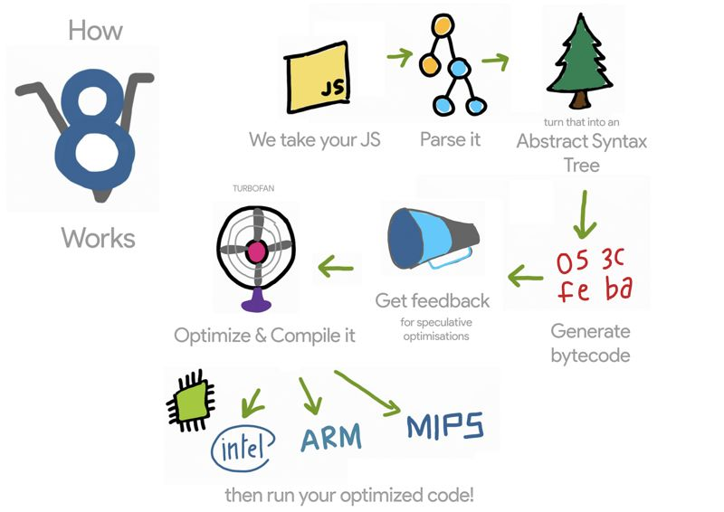
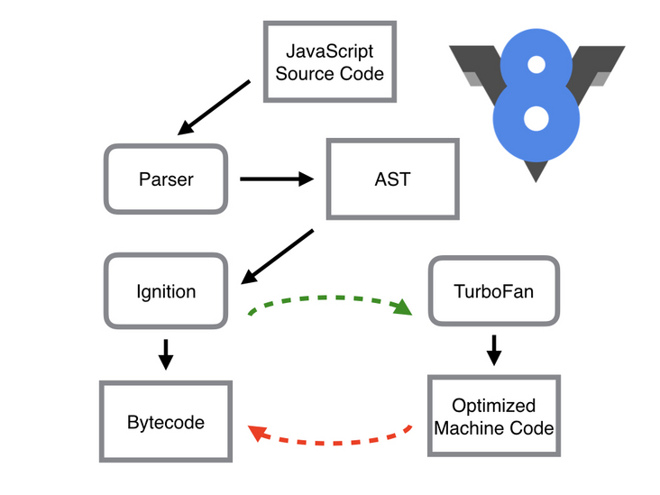
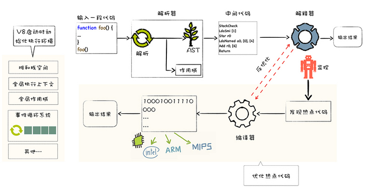

# CH1

ES5 -> EcmaScript 2009
ES6 -> EcmaScript 2015

#### 并非所有能在 script 中编写的代码都是 JS

像 alert, getCurrentLocation, navigator.getUserMedia 等，并不是 JS 的一部分，
我们可以称之为 WebApi 或者 BOM ，浏览器提供的对象方法，同样 DOM 也并不是 JS 的一部分

#### 浏览器的控制台 dev-tool 虽好用却并不是完全严谨的 JS 执行环境

#### JS 编码的泛型

- 面向过程
- 面向对象
- 函数式
（...待扩展补充）
#### 历代 JS 版本，更新的兼容性

JS 执行引擎会向后兼容，并偶尔有 break change，但老的引擎不会更新加入新版语法
因此为了兼容老版浏览器引擎，即想要书写新版 JS 在老版浏览器上运行，可以使用 babel 进行转译

#### JS 究竟是解释型语言还是编译型语言

`计算机是无法理解和执行高级语言的，它只能直接理解机器语言，所以使用任何高级语言编写的程序若想被计算机运行，都必须将其转换成计算机语言，也就是机器码。`

而现今市面上的主流高级语言以转译为机器码的时机被分成两类

| 类型       | 原理                                                                                                            | 优点                                                                   | 缺点                         |
| ---------- | --------------------------------------------------------------------------------------------------------------- | ---------------------------------------------------------------------- | ---------------------------- |
| 编译型语言 | 通过专门的编译器，将所有源代码一次性转换成特定平台（Windows、Linux 等）执行的机器码（以可执行文件的形式存在）。 | 编译一次后，脱离了编译器也可以运行，并且运行效率高。                   | 可移植性差，不够灵活。       |
| 解释型语言 | 由专门的解释器，根据需要将部分源代码临时转换成特定平台的机器码。                                                | 跨平台性好，通过不同的解释器，将相同的源代码解释成不同平台下的机器码。 | 一边执行一边转换，效率很低。 |

但是 JS 像 JAVA 一般，介于这两者之间

1. JS 会先经过编译器（如 Babel）编译重新生成代码
2. 重新生成的代码由解释器 V8 引擎处理

解释器的工作原理就是经典的编译原理场景，大致包括
词法分析、语法分析、语义分析、性能优化、生成可执行文件

所以在这一步骤中 V8 引擎还是充当了中间解释器的作用，就像 JVM 之于 JAVA 一般，因此 JS 能够跨平台运行
那么照理来说 JS 已经是妥妥的解释型语言了，**但是作者给出的结论是 JS 是编译型语言**

曾经的 JS 的的确确是解释型语言（脚本语言），在V8出现之前，所有的 JavaScript 虚拟机所采用的都是解释执行的方式，自上而下、一行接一行的编译执行语句，这是 JavaScript 执行速度过慢的一个主要原因。而 V8 率先引入了**即时编译（JIT）的双轮驱动的设计（混合使用编译器和解释器的技术）**，这是一种权衡策略，混合编译执行和解释执行这两种手段，给 JavaScript 的执行速度带来了极大的提升。

  

我们可以先来看一下一个现代工程中一段 JS 代码是如何被编译且执行的：

1. **Babel 解析及转译**
   - 词法分析：
     babel-loader 拿到执行上下文的时候，会把代码从上到下一行一行的进行分词/词法分析（Tokenizing/Lexing），例如 var a = 1; ，会被分成 var 、 a 、 1 、 ; 这样的原子符号（atomic token）。词法分析 = 指登记变量声明 + 函数声明 + 函数声明的形参。若词法分析中有词法错误，如关键词错误等。
   - 语法分析:
     在词法分析结束后，会做语法分析，引擎将 token 解析成一个抽象语法树（AST），在这一步会检测是否有语法结构错误，如果有则直接报错不再往下执行
     **注意**： 词法分析跟语法分析不是完全独立的，而是交错运行的。也就是说，并不是等所有的 token 都生成之后，才用语法分析器来处理。一般都是每取得一个 token ，就开始用语法分析器来处理了
   - 语义分析：
     检查语法结构正确后，仍然需要检查分析语句表达的意义，该步相当复杂
   - 优化并重新生成 JS （此处的优化并非传统编译原理上的优化和生成目标代码）
2. **V8 引擎处理**，V8 主要有 4 个模块
   - Parser：词法分析、语法分析、语义分析 -> 生成 AST
   - Ignition：解释器，负责将 AST 转换为 Bytecode，解释执行 Bytecode；同时收集监听收集 TurboFan 优化编译所需的信息，比如函数参数的类型；解释器执行时主要有四个模块，内存中的字节码、寄存器、栈、堆。
   - TurboFan：compiler，即编译器，利用 Ignition 所收集的热点代码信息，将 Bytecode 转换为优化的汇编代码，执行该段代码时可直接执行机器码 
   - Orinoco：garbage collector，垃圾回收模块，负责将程序不再需要的内存空间回收。
  

    
  

  简单地说，**Parser 将 JS 源码转换为 AST，然后 Ignition 将 AST 转换为 Bytecode，最后 TurboFan 将 Bytecode 转换为经过优化的 Machine Code(实际上是汇编代码)。**

 因此截止目前，JS 相对而言已经无法简单的定性为解释型语言或编译型语言了 

 `These misinformed claims and criticisms should be set aside. The real reason it matters to have a clear picture on whether JS is interpreted or compiled relates to the nature of how errors are handled. <you dont know JS yet>`
   
这些错误的主张和批评应该被搁置一旁。想要清楚地了解 JS 是解释型语言还是编译型语言，我们可以参考 JS 中的语法错误是如何被抛出的。

编译型语言的语法错误，会在词法分析、语法分析、语义分析过程中被抛出，也就是在真正执行代码之前，而 JS 无论是经过 Webpack Eslint 的语法检查，或是 V8 的解析检查，其错误会在机器码被执行之前抛出，该点同编译型语言一致

且综上对 V8 执行过程的描述，比起单纯的自上而下、一行一行执行的解释型语言，V8 的执行方式要复杂的多，混合了编译和解释，结合上文所述 V8 的模块

1. 初始化基础环境
2. Parser 解析源码生成 AST 和作用域
3. Ignition 依据 AST 和作用域生成字节码，并收集 TurboFan 优化编译所需的信息
4. TurboFan 解释执行字节码，并根据 Ignition 收集的信息优化编译
5. TurboFan 监听热点代码：
   - 若为热点代码，优化热点代码为二进制的机器代码，下次调用直接执行
   - 若信息错误，反优化生成的二进制机器代码

 

    
 

因此，作者将 JS 定性为编译型语言
不过以我的拙见，还是觉得无法轻易定性，甚至无需为 JS 定性
JS 依据其特性结合了解释与编译的优点，既能跨平台运行又相较于纯解释型更为高效

#### WASM

待续

#### Strict Mode
