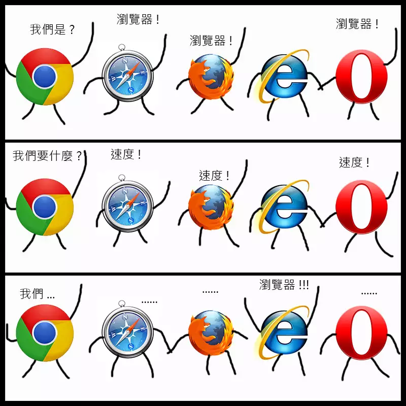
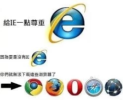

# meta 标签

### 开始我们先说说 meta 标签的作用：

meta 标签是 HTML 标记 head 区的一个辅助标签，它位于 HTML 文档的`<head>`和`<title>`之间（有些也不是在`<head>`和`<title>`之间）。**它提供的信息虽然对用户不可见，但是于浏览器可见**。可以说 meta 标签就是写给浏览器看的

HTML`<meta>`除了提供文档字符集、使用语言、作者等基本信息外，还可以定义页面编码语言、**搜索引擎优化**、**自动刷新并指向新的页面**、**控制页面缓冲**、
**响应式视窗** 等！

```
在查阅 w3school 中，第一句话中的 “元数据” 就让我开始了 Google 之旅。然后很顺利的在英文版的 w3school 找到了想要的结果。（中文 w3school 说的是元信息，Google 和百度都没有相关的词条。但元数据在 Google 就有详细解释。所以这儿采用英文版 W3school 的解释。）

不难看出，其中的关键是 metadata，中文名叫元数据，是用于描述数据的数据。它不会显示在页面上，但是机器却可以识别。这么一来 meta 标签的作用方式就很好理解了。
```

meta 常用于定义页面的说明，关键字，最后修改日期（缓存），和其它的元数据。这些元数据将服务于浏览器（如何布局或重载页面），搜索引擎和其它网络服务。

我们先来瞅瞅 meta 的几个属性标签：

<div align="center" style="margin: 15px">

|       属性       |                                             值                                             |                    描述                    |
| :--------------: | :----------------------------------------------------------------------------------------: | :----------------------------------------: |
| charset( H5 New) |                                       character_set                                        |             定义文档的字符编码             |
|     content      |                                            text                                            | 定义与 http-equiv 或 name 属性相关的元信息 |
|    http-equiv    |                         content-type<br> default-style<br> refresh                         |      把 content 属性关联到 HTTP 头部       |
|       name       | application-name<br>author<br>description<br>generator<br>keywords<br>copyright<br> robots |       把 content 属性关联到一个名称        |
| scheme(H5 删除)  |                                  format/URI HTML5 不支持                                   |     定义用于翻译 content 属性值的格式      |

<p>meta标签属性attributes</p>
</div>

## HTML 中 meta 标签的使用方法介绍:

## 1. charset

meta 最常见的无疑是定义 charset Unicode 字符集啦

```html
<!-- 默认UTF-8编码 -->
<meta charset="UTF-8" />
<!--如果 HTML5 网页使用不同于 UTF-8 的字符，则需要在 <meta /> 标签中指定，如下：-->
<meta charset="ISO-8859-1" />
```

为什么是 UTF-8，不能是 UTF-16 吗?

<div align="center">

| 字符集 |                                                                           描述                                                                            |
| :----: | :-------------------------------------------------------------------------------------------------------------------------------------------------------: |
| UTF-8  |           UTF8 中的字符可以是 1 到 4 字节长。UTF-8 可以代表 Unicode 标准中的任何字符。UTF-8 向后兼容 ASCII。UTF-8 是电子邮件和网页的首选编码。            |
| UTF-16 | 16 位 Unicode 转换格式是一种可变长度的 Unicode 字符编码，能够编码整个 Unicode 指令表。UTF-16 主要用于操作系统和环境，如 Microsoft Windows、Java 和 .NET。 |

<p>unicode常见字符集</p>
</div>
提示：Unicode 的前 128 个字符（与 ASCII 一一对应）使用一个与 ASCII二进制值相同的八位组进行编码，使有效的 ASCII 文本在进行 UTF-8 编码时也是有效的。

提示：所有的 HTML 4 处理器支持 UTF-8，所有的 HTML 5 和 XML 处理器支持 UTF-8 和 UTF-16！

## 2. name

name 属性主要用于描述网页，对应属性是 content ，以便于搜索引擎机器人查找、分类（目前几乎所有的搜索引擎都使用网上机器人自动查找 meta 值来给网页分类）。

#### keywords 页面关键词

```html
<meta
  name="keywords"
  content="个人活动发布，会办app，活动管理，会议管理，社群管理"
/>
```

#### description 页面描述

```html
<meta
  name="description"
  content="发布个人会议，发布公司会议，我们都可以帮你找到合适的会议地点和参会观众"
/>
```

#### author 网页作者

```html
<meta name="author" content="nzreal" />
```

#### robots 机器人抓取(搜索引擎爬取)

搜索引擎抓取 robots， 是一组使用逗号（，）分割的值，通常有如下几种取值：none，noindex，nofollow，all，index 和 follow。默认值是 all

信息参数为 all：文件将被检索，且页面上的链接可以被查询；
信息参数为 none：文件将不被检索，且页面上的链接不可以被查询；
信息参数为 index：文件将被检索；
信息参数为 follow：页面上的链接可以被查询；
信息参数为 noindex：文件将不被检索，但页面上的链接可以被查询；
信息参数为 nofollow：文件将被检索，但页面上的链接不可以被查询；

```html
<meta name="robots" content="all" />
```

#### google 针对于浏览器的设置

禁止 Chrome 浏览器中自动提示翻译

```html
<meta name="google" value="notranslate" />
```

#### app-version 版本号说明

```html
<meta name="app-version" content="1.13.3" />
```

#### copyright 版权

```html
<meta name="copyright" content="本网站版权归XX所有" />
```

#### generator 使用编译器

一般由编译器自动生成

```html
<meta name="generator" content="你所用的编辑器" />
```

#### revisit-after 网站重访

content="7 days" 是让搜索引擎每隔 7 天访问一次我们的网页

一般来说，网站并不需要使用 revisit-after 来限制搜索引擎的访问频率。
而只有当网站数据量非常大，被搜索引擎频繁的抓取，会占用过多的服务器资源，这会影响网站的访问反应速度。在这种情况下，我们并不希望搜索引擎过于频繁抓取网页，一般设置成每隔 5—7 天来访问抓取一次网页即可
同时限制抓取频率，但不能通过设置它来提高抓取频率

```html
<meta name="revisit-after" content="7 days" />
```

## 3. http-equiv

http-equiv 顾名思义，相当于 http 的文件头作用，它可以向浏览器传回一些有用的信息，以帮助正确和精确地显示网页内容，与之对应的属性值为 content，content 中的内容其实就是各个参数的变量值。

#### refresh 页面重定向和刷新

数字代表几秒后进行跳转

```html
<meta http-equiv="refresh" content="5; url=https://github.com/nzreal" />
```

#### expires 缓存过期时间

缓存过期时间，用来指定资源到期的时间，是服务器端的具体的时间点。也就是说，Expires=max-age + 请求的现在时间，需要和 Last-modified 结合使用。cache-control 的优先级更高。
注意：必须使用 GMT 的时间格式，或者直接设为 0（数字表示多久后过期）

```html
<meta http-equiv="expires" content="Wed, 26 Feb 1997 08:21:57 GMT" />
```

#### Pragma 缓存标签

含义是让浏览器不缓存当前页面。但是代理服务器不解析 HTML 内容，一般应用广泛的是用 HTTP 头信息控制缓存。
注意：网页不保存在缓存中，每次访问都刷新页面。这样设定，访问者将无法脱机浏览。

```html
<meta http-equiv="Pragma" content="no-cache" />
```

#### Set-Cookie cookie 设定

Set-Cookie（cookie 设定）浏览器访问某个页面时会将它存在缓存中，下次再次访问时就可从缓存中读取，以提高速度。当你希望访问者每次都刷新你广告的图标，或每次都刷新你的计数器，就要禁用缓存了。
如果网页过期，那么存盘的 cookie 将被删除。
注意：必须使用 GMT 的时间格式

```html
<meta
  http-equiv="Set-Cookie"
  content="cookievalue=xxx; expires=Wednesday, 21-Oct-98 16:14:21 GMT; path=/"
/>
```

#### Cache-Control 缓存控制

Cache-Control 指定请求和响应遵循的缓存机制。在请求消息或响应消息中设置 Cache-Control 并不会修改另一个消息处理过程中的缓存处理过程。请求时的缓存指令包括 no-cache、no-store、max-age、max-stale、min-fresh、only-if-cached，响应消息中的指令包括 public、private、no-cache、no-store、no-transform、must-revalidate、proxy-revalidate、max-age。各个消息中的指令含义如下

- Public 指示响应可被任何缓存区缓存
- Private 指示对于单个用户的整个或部分响应消息，不能被共享缓存处理。这允许服务器仅仅描述当用户的部分响应消息，此响应消息对于其他用户的请求无效
- no-cache 指示请求或响应消息不能缓存
- no-store 用于防止重要的信息被无意的发布。在请求消息中发送将使得请求和响应消息都不使用缓存。
- max-age 指示客户机可以接收生存期不大于指定时间（以秒为单位）的响应
- min-fresh 指示客户机可以接收响应时间小于当前时间加上指定时间的响应
- max-stale 指示客户机可以接收超出超时期间的响应消息。如果指定 max-stale 消息的值，那么客户机可以接收超出超时期指定值之内的响应消息。

```html
<!---禁止百度转码-->
<meta http-equiv="Cache-Control" content="no-siteapp" />
```

#### Window-target 显示窗口的设定

作用是设置页面显示的窗口方式，设置 content="\_top"可以强制网页在当前窗口以独立页面显示，就能禁止自己页面被嵌套在其他网页当中！

content 属性后面的选项一共可以有四种属性值，分别如下：

- top：表示页面以当前整个窗口显示
- blank： 表示页面以新打开的窗口显示
- parent：表示页面以父容器或窗口显示，比如，框架嵌套
- self：表示页面以当前容器或窗口显示，比如，框架嵌套

```html
<meta http-equiv="Window-target" content="_top" />
```

#### content-Type 显示字符集的设定

设定页面使用的字符集
html4 仍然在使用，html5 请使用 charset 来定义

- meta 标签的 charset 的信息参数如 GB2312 时，代表说明网站是采用的编码是简体中文；
- meta 标签的 charset 的信息参数如 BIG5 时，代表说明网站是采用的编码是繁体中文；
- meta 标签的 charset 的信息参数如 iso-2022-jp 时，代表说明网站是采用的编码是日文；
- meta 标签的 charset 的信息参数如 ks_c_5601 时，代表说明网站是采用的编码是韩文；
- meta 标签的 charset 的信息参数如 ISO-8859-1 时，代表说明网站是采用的编码是英文；
- meta 标签的 charset 的信息参数如 UTF-8 时，代表世界通用的语言编码；

```html
<meta http-equiv="content-Type" content="text/html;charset=utf-8" />
```

#### content-Language 显示语言的设定

显示语言

```html
<meta http-equiv="Content-Language" content="zh-cn" />
```

#### Content-Script-Type 脚本类型

W3C 网页规范，指明页面中脚本的类型。

```html
<meta http-equiv="Content-Script-Type" content="text/javascript" />
```

#### viewport 手机浏览器虚拟窗口

手机浏览器是把页面放在一个虚拟的“窗口”（viewport）中，通常这个虚拟的“窗口”（viewport）比屏幕宽，这样就不用把每个网页挤到很小的窗口中（这样会破坏没有针对手机浏览器优化的网页的布局），用户可以通过平移和缩放来看网页的不同部分。移动版的 Safari 浏览器最新引进了 viewport 这个 meta tag，让网页开发者来控制 viewport 的大小和缩放，其他手机浏览器也基本支持。

此处不再展开细讲，有机会额外写一篇文章讲述

- width：控制 viewport 的大小，可以指定的一个值，如果 600，或者特殊的值，如 device-width 为设备的宽度（单位为缩放为 100% 时的 CSS 的像素）。
- height：和 width 相对应，指定高度。
- initial-scale：初始缩放比例，也即是当页面第一次 load 的时候缩放比例。
- maximum-scale：允许用户缩放到的最大比例。
- minimum-scale：允许用户缩放到的最小比例。
- user-scalable：用户是否可以手动缩放

一个常用的针对移动网页优化过的页面的 viewport meta 标签大致如下：

```html
<meta
  name="viewport"
  content="width=device-width; initial-scale=1.0; maximum-scale=1.0; user-scalable=0;"
/>
```

#### X-UA-Compatible IE8 兼容

首先，众所周知，IE8 是个神奇的版本，令无数前端开发者抓耳挠腮

<div align="center" >
<div style="display: flex; justify-content: space-between; flex-wrap: wrap">



</div>

<p style="color: #777">老IE了</p>
</div>
这是个是 IE8 的专用标记，用来指定 IE8 浏览器去模拟某个特定版本的 IE 浏览器的渲染方式（比如 IE6），以此来解决部分兼容问题，例如模拟 IE7 的具体方式如下：

```html
<meta http-equiv="X-UA-Compatible" content="IE=EmulateIE7" />
```

以上代码告诉 IE 浏览器，无论是否用 DTD 声明文档标准，IE8/9 都会以 IE7 引擎来渲染页面。

但令我好奇的是，此处这个标记后面竟然出现了 chrome 这样的值，难道 IE 也可以模拟 chrome 了？

```html
<meta http-equiv="X-UA-Compatible" content="IE=edge,chrome=1" />
```

迅速搜索了一下，才明白原来不是微软增强了 IE，而是谷歌做了个外挂：Google ChromeFrame（谷歌内嵌浏览器框架 GCF）。这个插件可以让用户的 IE 浏览器外不变，但用户在浏览网页时，实际上使用的是 GoogleChrome 浏览器内核，而且支持 IE6、7、8 等多个版本的 IE 浏览器，谷歌这个墙角挖的真给力！
而上文提到的那个 meta 标记，则是在是安装了 GCF 后，用来指定页面使用 chrome 内核来渲染。

GCF 下载地址:http://code.google.com/intl/zh-CN/chrome/chromeframe/

安装完成后,如果你想对某个页面使用 GCF 进行渲染，只需要在该页面的地址前加上 gcf： 即可，例如：gcf:http://cooleep.com

但是如果想要在开发时指定页面默认首先使用 GCF 进行渲染，如果未安装 GCF 再使用 IE 内核进行渲染，该如何进行呢？

就是使用这个标记。

**标记用法：**

阅读了下 chrome 的开发文档（http://www.chromium.org/developers/how-tos/chrome-frame-getting-started　，需翻墙），下面来简单讲解一下这个标记的语法。

1. 最基本的用法：在页面的头部加入

```html
<meta http-equiv="X-UA-Compatible" content="chrome=1" />
```

用以声明当前页面用 chrome 内核来渲染。
复杂一些的就是本文一开始看到的用法：

```html
<meta http-equiv="X-UA-Compatible" content="IE=edge,chrome=1" />
```

这样写可以达到的效果是如果安装了 GCF，则使用 GCF 来渲染页面，如果未安装 GCF，则使用最高版本的 IE 内核进行渲染。

2. 通过修改 HTTP 头文件的方法来实现让指定的页面使用 GCF 内核进行渲染：在 HTTP 的头文件中加入以下信息：X-UA-Compatible: chrome=1
   在 Apache 服务器中，确保 mod_headers 和 mod_setenvif 文件可用，然后在 httpd.conf 中加入以下配置信息：

```apache
<IfModule mod_setenvif.c>
  <IfModule mod_headers.c>
    BrowserMatch chromeframe gcf Header append X-UA-Compatible "chrome=1"
    env=gcf
  </IfModule>
</IfModule>
```

在 IIS7 或者更高版本的服务器中，只需要修改 web.config 文件,添加如下信息即可即可:

```xml
<configuration>
  <system.webServer>
    <httpProtocol>
      <customHeaders>
        <add name = "X-UA-Compatible" value = "chrome=1" />
      </customHeaders>
    </httpProtocol>
  </system.webServer>
</configuration>
```

#### imagetoolbar 图片工具栏(只支持到 IE6)

指定是否显示图片工具栏，当为 false 代表不显示，当为 true 代表显示。
该项属性的资料已极少，只支持到 IE6，具体功能属性不看也罢
大致就是图片大小大于网页可视区域鼠标移到图片上会出现可调整大小的工具栏
详情见：https://www.metatags.org/all-meta-tags-overview/meta-equiv-imagetoolbar/

```html
<meta http-equiv="imagetoolbar" content="false" />
```

以上都是关于 HTML meta 标签的作用和使用方法，还有很多属性．

<div style="border-bottom: 1px solid #dcdcdc; margin-bottom: 20px"></div>

再来分享几个著名网站的首页的 meta 文件：

#### 京东首页的 meta 设置：

```html
<meta charset="gbk" />

<meta
  name="description"
  content="京东 JD.COM-专业的综合网上购物商城,销售家电、数码通讯、电脑、家居百货、服装服饰、母婴、图书、食品等数万个品牌优质商品.便捷、诚信的服务，为您提供愉悦的网上购物体验!"
/>

<meta
  name="Keywords"
  content="网上购物,网上商城,手机,笔记本,电脑,MP3,CD,VCD,DV,相机,数码,配件,手表,存储卡,京东"
/>
```

#### 淘宝首页的 meta 设置：

```html
<meta charset="utf-8" />

<meta http-equiv="X-UA-Compatible" content="IE=edge,chrome=1" />

<meta name="renderer" content="webkit" />

<meta name="spm-id" content="a21bo" />

<meta
  name="description"
  content="淘宝网-亚洲最大、最安全的网上交易平台，提供各类服饰、美容、家居、数码、话费/点卡充值…8 亿优质特价商品，同时提供担保交易(先收货后付款)、先行赔付、假一赔三、七天无理由退换货、数码免费维修等安全交易保障服务，让你全面安心享受网上购物乐趣！"
/>

<meta name="keyword" content="" />
```

#### 优酷首页的 meta 设置：

```html
<meta charset="utf-8" />

<meta http-equiv="X-UA-Compatible" content="IE=Edge" />

<meta
  name="title"
  content="优酷-中国领先视频网站,提供视频播放,视频发布,视频搜索-优酷视频"
/>

<meta name="keywords" content="视频,视频分享,视频搜索,视频播放,优酷视频" />

<meta
  name="description"
  content="视频服务平台,提供视频播放,视频发布,视频搜索,视频分享"
/>
```

通过看到大网站对于 meta 的设置，我们可以看到常用的有：X-UA-Compatible、keywords、description 这三种，我们要好好学会用。

##### 参考修改整理自：https://blog.csdn.net/zhangank/article/details/94014629 及 https://blog.csdn.net/ssisse/article/details/51590584

##### 这两篇文章写得较全，故转载补充以 mark 来学习，大家可以去看看原文
